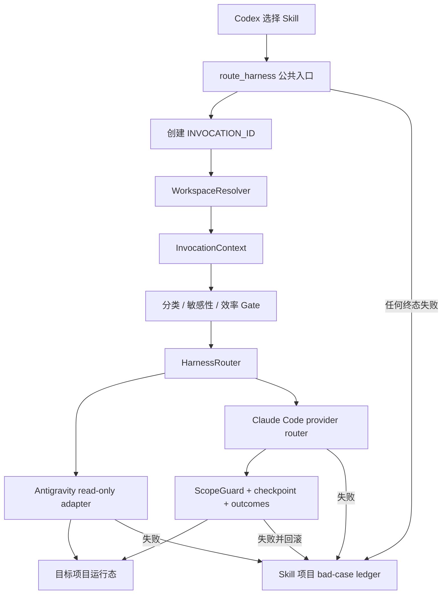

# 全局 Skill 生产加固、跨项目调用与失败案例闭环实施设计

## 0. 文档控制

|字段|值|
|---|---|
|状态|WP-0 至 WP-6 已完成 Codex Review Gate；macOS 全量验证通过；WP-7/Windows 原生真实 smoke 尚未完成，因此 Goal 仍为 active，不声明生产完成|
|基线提交|实现前快照 `a8a88a5fdbfdf897d74a8e072c1b6df3e0e732c7`；实现提交以 Git 历史为准|
|基线日期|2026-08-05|
|适用范围|`external-agent-collaboration` Codex-only Skill 的全局发现、任务分类、跨项目调用、Claude Code/Antigravity 路由、受控执行、失败记录、双平台验证与发布|
|目标施工者|Luna 级模型；不假设施工者能自行补齐未写明的架构决定|
|施工编排|一个持续 Goal 覆盖 WP-0 至 WP-7；每个 WP 包含一个或多个 Run，并在进入下一 WP 前通过 Codex Review Gate|
|目标平台|macOS 与原生 Windows；Windows 不依赖 WSL、Git Bash 或 POSIX 兼容层|
|当前回归证据|2026-08-05 本机 `run_regression.py`：53 个脚本通过；`quality_gate.py --privacy` 与标准库 `coverage_gate.py --check` 通过；此前 GitHub Actions run `30980230261` 的 macOS/Windows × Python 3.10/3.13 四矩阵已通过；本轮新增协议契约哈希、运行态 artifact 路径与缓存排除测试已纳入回归|
|设计复核|2026-08-05，Claude Code harness + DeepSeek，run `1785899848-0adfeaa0`，结论 `ready_with_revisions`；6 个 P0 与全部 P1/P2 文档歧义已回写本文|
|完成判定|仍仅以第 18 节的可执行完成门槛为准；本机通过不替代 Windows 原生验证、真实最小 smoke、实际 hook 能力证据和最终 Codex Review Gate|

本文是一次生产加固专题的唯一施工入口。它不替代当前 PRD、技术方案、实施计划和测试文档；实现完成后，施工者必须按第 17 节把已经生效的规则回写到当前规范，并在专题索引中更新状态。

### 0.1 当前 Goal 与阶段交付状态（2026-08-05）

Goal `global-skill-production-hardening-v2` 仍为 `active`。Codex 已接受以下阶段包：WP-0 `CP-005-WP-0`/`RV-005`、WP-1 `CP-006-WP-1`/`RV-006`、WP-2 `CP-007-WP-2`/`RV-007`、WP-3 `CP-008-WP-3`/`RV-008`、WP-4 `CP-009-WP-4`/`RV-009`、WP-5 `CP-010-WP-5`/`RV-010`、WP-6 `CP-011-WP-6`/`RV-011`。WP-1 包含 Unicode、空格和括号路径修复；WP-4 至 WP-6 只声明已实际运行的平台证据。

本轮还修复了施工协议的三个确定性缺口：Codex runner 可安全写入 `.ai-collaboration` 运行态输入、manifest 排除生成的 `__pycache__`/`.pyc`、checkpoint 的 `goal_contract_sha256` 必须匹配实际契约文件字节哈希。旧 checkpoint 不作为最终证据，当前 Goal 状态已指向上述最新 accepted packet。

尚未通过的发布门是 WP-7 的最终文档/隐私/CI/发布复验，以及原生 Windows 上的真实 provider smoke、Windows 本地回归与 Windows 相关 criterion。Windows Codex 请按 [WP-7 Windows 生产接手文档](WINDOWS_PRODUCTION_HANDOFF.md) 执行；不得把 CI 或 macOS 结果替代真实 Windows provider 证据。

## 1. 结论先行

当前实现适合受控开发和人工监督下的本仓库调用，尚不满足“全局安装后可在任意项目稳定调用、失败可追溯、受控执行不会越界、macOS/Windows 行为一致”的生产定义。

本轮必须完成以下六项结果，缺一项不得宣布生产可用：

1. 将 Skill 源仓库、共享运行态、任务目标仓库、任务工作目录和目标项目运行态拆成独立对象，消除固定 `PROJECT_ROOT` 对跨项目调用的阻断。
2. 每次已经进入 Skill 公共调用入口但最终失败的调用，在本 Skill 项目写入且只写入一条脱敏 bad-case 事件；调用 Provider 之前失败也必须记录。
3. 修复符号链接/Windows junction 越界、外部读取边界、解析后异常未回滚和并发写覆盖，建立可证明的范围与状态安全。
4. 修复 Antigravity 响应已解析却未返回/未持久化的问题，使独立评审真正产生可消费贡献。
5. 提高 Codex 的隐式选择命中率，同时用结构化分类、预算和负例回归限制误触发；不得用“所有任务都调用外部模型”换取可见度。
6. 在 macOS 与原生 Windows 上通过同一验收矩阵，并完成真实、最小、无敏感数据的跨项目 smoke。

## 2. 非目标与硬边界

本轮不做以下事情：

- 不允许 Claude Code、Antigravity、DeepSeek、MiMo 或其它 Agent 自主调用本 Skill。本 Skill 仍然只允许 Codex 选择和调用。
- 不改变“Claude Code 是 harness，DeepSeek/MiMo 是 Claude Code 隔离 profile 中的 Provider”这一职责，不向 runner 传 `--model`。
- 不改变显式 Provider、精确 session、正常路由、健康过滤和仅一次可用性故障切换的优先级。
- 不为失败自动创建无限重试、自动辩论或递归协作。
- 不把 token、profile 正文、完整 prompt/handoff、完整 Provider 输出、绝对个人路径或客户数据写入 bad-case 日志。
- 不把 macOS session 迁移成 Windows session，也不猜测跨平台路径映射。
- 不把安装全局依赖、提交、推送、部署或发布权限交给外部协作者。
- 不以修改目标项目的 `.gitignore` 作为全局 Skill 可用的前置条件；目标项目没有 `.ai-collaboration/` 时可由本地调用创建，但新增文件默认不进入 Git。

## 3. 术语和唯一含义

下列名称必须进入代码；不得继续用一个 `PROJECT_ROOT` 表示多个概念。

|名称|定义|默认位置|是否允许含凭据|
|---|---|---|---|
|`SKILL_ROOT`|包含 `SKILL.md`、`scripts/`、`references/` 的实际目录；对全局符号链接先解析到源目录|`<skill-project>/.agents/skills/external-agent-collaboration`|否|
|`SKILL_PROJECT_ROOT`|承载本 Skill 源码的 Git 仓库根；用于中央 bad-case ledger 和版本识别|当前 ExtAgentCollaboration 仓库|否；其 ignored local profile 除外|
|`SHARED_CONTROL_ROOT`|跨目标项目共享的 Provider/harness 配置、信任、健康和能力状态|`<skill-project>/.ai-collaboration`|可在 Git 忽略的 local profile 中含 token；任何输出不得回显|
|`TARGET_PROJECT_ROOT`|本次用户任务所属仓库或明确声明的项目根|例如 DriversLicense 根目录|目标项目自身规则决定；扫描后才能外发|
|`TARGET_WORKDIR`|本次命令的实际工作目录，必须位于 `TARGET_PROJECT_ROOT` 内|通常等于目标项目根|否|
|`TARGET_CONTROL_ROOT`|本次任务的 handoff、topic、session、goal、output、snapshot 状态根|`<target-project>/.ai-collaboration`|禁止含凭据|
|`FAILURE_LEDGER_ROOT`|所有最终失败调用的中央脱敏事件目录|`<skill-project>/.ai-collaboration/bad-cases`|严格禁止|
|`INVOCATION_ID`|公共入口收到请求后、任何可失败校验前生成的唯一 ID|UUIDv4 或时间前缀加 UUID|否|
|`RUN_ID`|Provider/harness 已进入实际运行阶段后生成的运行 ID|目标项目运行态|否|
|`WORKSPACE_IDENTITY`|目标项目的本机稳定身份，仅用于匹配 session；由规范路径和平台计算后哈希|状态 JSON|只存哈希|

`INVOCATION_ID` 与 `RUN_ID` 不得互换：没有调用 Provider 的失败仍有 `INVOCATION_ID`，但 `RUN_ID` 必须为 `null`。

## 4. 已观察 bad case：DriversLicense 独立复核失败

### 4.1 事实时间线

另一个项目请求 Codex 对“Luna 是否能按文档无歧义施工”做独立只读复核。Codex正确选择了全局 `external-agent-collaboration`，显式选择 `antigravity_readonly`，并将：

- handoff 放在 DriversLicense 的 `.ai-collaboration/handoffs/`；
- `--working-directory` 指向 DriversLicense 根目录；
- action 设为 `critique`；
- 权限设为只读语义。

第一次调用在工作目录校验处失败。随后去掉 `--working-directory` 重试，仍然失败。Codex没有绕过路径边界，回到目标仓库本地证据继续施工；这个安全选择是正确的。

### 4.2 根因

当前 `collaborate.py` 在模块导入时固定：

```python
PROJECT_ROOT = Path(__file__).resolve().parents[4]
CONTROL_ROOT = PROJECT_ROOT / ".ai-collaboration"
```

这使以下原本不同的对象全部被绑定到 ExtAgentCollaboration：

- Skill 源码位置；
- Provider 配置与信任位置；
- session/topic/output/snapshot 位置；
- 目标项目根；
- handoff 允许范围；
- 子进程 cwd。

`safe_workdir()` 和 `relative()` 要求目标路径位于固定 `PROJECT_ROOT` 下；`route_harness.py::run_child()` 又始终以这个根启动子进程。因此 DriversLicense 作为同级仓库必然被拒绝。

第二次去掉 `--working-directory` 不构成有效降级：工作目录回到 ExtAgentCollaboration，但 handoff 仍属于 DriversLicense，仍会被同一 `relative()` 拒绝。这个错误在当前架构下不可通过相同参数重试恢复。

### 4.3 正确错误分类

该事件必须记录为：

```json
{
  "stage": "workspace_resolution",
  "terminal_status": "failed_preflight",
  "error_code": "cross_project_context_unsupported",
  "retryable": false,
  "provider_invoked": false,
  "requested_harness": "antigravity",
  "selected_harness": "antigravity",
  "run_id": null
}
```

它不是 Provider failure、Antigravity failure、权限拒绝或目标仓库配置错误。相同请求的第二次无效调用应通过 `parent_invocation_id` 关联；用户可见结果必须明确 `retryable: false` 和 `next_action: "upgrade_workspace_context"`，避免 Codex盲目删参数重试。

## 5. 目标架构



### 5.1 `InvocationContext`

新增 `scripts/workspace_context.py`，定义不可变数据类：

```python
@dataclass(frozen=True)
class InvocationContext:
    skill_root: Path
    skill_project_root: Path
    shared_control_root: Path
    target_project_root: Path
    target_workdir: Path
    target_control_root: Path
    failure_ledger_root: Path
    workspace_identity_hash: str
    host_platform: str
```

所有依赖项目路径的函数必须显式接收 `context` 或其中的明确路径。`workspace_identity_hash` 只保存 `sha256(<host-platform> + NUL + <canonical-root>)` 的十六进制摘要；原始根路径只存在于进程内的 `target_project_root`，不得进入共享 metrics 或 failure ledger。禁止在业务函数内回读模块级 `PROJECT_ROOT`/`CONTROL_ROOT`。模块级只允许无状态常量、schema 和枚举。

Skill 自身根解析不得接受目标项目或调用者覆盖：`SKILL_ROOT = Path(__file__).resolve(strict=True).parent.parent`；随后执行 `git -C SKILL_ROOT rev-parse --show-toplevel` 得到 `SKILL_PROJECT_ROOT`，并以 `samefile()`（Windows 用规范化 file identity fallback）证明 `<root>/.agents/skills/external-agent-collaboration` 与 `SKILL_ROOT` 是同一目录。全局 symlink 因为先 resolve，会正确回到本源仓库。若找不到或验证不一致，返回 `skill_project_root_unavailable`，写可用 fallback 事件且不调用 Provider；本轮不支持脱离源项目的复制式安装，因为它无法满足“失败集中写回本 Skill 项目”的需求。

### 5.2 状态归属

|状态|归属|原因|
|---|---|---|
|Provider/harness shared 与 local profile|`SHARED_CONTROL_ROOT`|全局 Skill 复用同一已配置 harness；避免每个项目复制 token|
|Provider/harness trust、health、capabilities|`SHARED_CONTROL_ROOT`|绑定本地 profile/launcher/平台，而非某个目标项目|
|聚合 provider metrics|`SHARED_CONTROL_ROOT`|支持全局成本、质量和健康判断|
|sessions、topics、goals|`TARGET_CONTROL_ROOT`|绑定目标工作区，不能跨项目误恢复|
|handoffs、outputs、logs、snapshots|`TARGET_CONTROL_ROOT`|属于具体目标任务；便于目标项目内审计|
|bad-case events|`FAILURE_LEDGER_ROOT`|用户要求在 Skill 项目集中复盘全部失败|

当 `TARGET_PROJECT_ROOT == SKILL_PROJECT_ROOT` 时，两类 control root 可解析到同一目录，必须保持当前本仓库行为兼容，不复制数据。

## 6. 目标项目解析契约

### 6.1 CLI

`route_harness.py`、`collaborate.py` 和 `consult_antigravity.py` 新增：

```text
--project-root PATH      目标项目根；全局调用推荐显式传入
--working-directory PATH
--invocation-id ID       内部透传；用户通常不传
--failure-event-owner {router,parent,direct}
```

解析顺序固定为：

1. 公共 router 创建或校验 `INVOCATION_ID`。
2. 若传 `--project-root`，将其作为候选目标根。
3. 若未传，先取显式 `--working-directory`；未传则取进程 cwd。
4. 对候选 workdir 执行 `git -C <workdir> rev-parse --show-toplevel`，必须用 argv、`shell=False`。
5. Git 成功时使用其规范根；显式 `--project-root` 与 Git 根不一致时失败，不猜测。
6. 非 Git 目录只有显式 `--project-root` 时才可使用；否则返回 `project_root_required_for_non_git_workspace`。
7. handoff、outcomes、goal contract、allow path、workdir 均相对于 `TARGET_PROJECT_ROOT` 解析并校验。
8. Provider 配置、信任和 health 只从 `SHARED_CONTROL_ROOT` 读取。
9. 子 runner 收到规范化后的绝对 `--project-root`、`--working-directory`、`--invocation-id`，不得再次用不同规则猜根。
10. 子进程 cwd 设为 `TARGET_WORKDIR`；脚本路径始终使用 `SKILL_ROOT/scripts/...` 的绝对路径。

路径不存在、不是目录、workdir 不在 project root 内、handoff 不在 project root 内、显式根与 Git 根冲突都必须在 Provider 调用前失败。

Windows 的 Git 根解析按以下规则实现：捕获 `git rev-parse` 的 stdout 后去除行尾，不把 `/` 手工替换成 `\`，而是交给 `Path`/`os.path` 规范化；若输入或输出是 UNC，必须保持 server/share。单元测试通过可注入 `GitRootResolver` 返回 `\\server\share\repo` 验证比较逻辑；Windows CI 还必须对本地盘真实 Git repo 运行集成测试。只有验收机器已经提供可写 SMB share 时才运行真实 UNC smoke，缺少 share 记录为 P2 环境限制，不阻断本地盘生产能力，也不得声称“真实 UNC 已验证”。

### 6.2 路径比较

新增统一函数，不允许散落使用字符串前缀：

```python
canonical_path(path, *, must_exist)
is_within(path, root, *, link_policy)
relative_to_root(path, root)
workspace_identity(root, host_platform)
```

要求：

- macOS 对现有路径使用 `Path.resolve(strict=True)`，不存在的写目标先解析最近存在父目录，再逐段验证。
- Windows 使用 `os.path.normcase` 处理盘符和大小写；`C:\Repo` 与 `c:\repo` 可为同一规范路径。
- UNC 根必须保持 `\\server\share` 语义；禁止把不同 share 视为同一根。
- 不用 `str(path).startswith(str(root))` 做包含判断。
- Windows junction/reparse point 与 POSIX symlink 同等对待。
- 支持路径含空格、中文、括号和非 ASCII；所有 subprocess 使用 argv 与 `shell=False`。

`link_policy` 只允许：

- `reject_any`：从 root 的下一层开始到最终组件，任一现有组件是 symlink、junction 或其它 reparse point 即失败；root 自身也必须在创建 context 时单独验证不是链接/reparse point。execute allow path、workdir、handoff 和所有写目标使用此值。
- `preserve_leaf`：只供 manifest/checkpoint 遍历；允许把链接节点作为不透明 leaf 记录/复制，但绝不跟随其 target，也不得把链接 leaf 纳入 allow path。

删除原设计中的布尔 `reject_links`，避免“是否包含最终组件、是否包含 root”由实现者猜测。

## 7. 失败案例 ledger

### 7.1 “调用失败”的唯一口径

只要 Codex 已选择本 Skill 并进入任一公共调用入口，且最终没有返回 `completed`，就必须有一条 canonical failure event，包括：

- 参数解析后的 workspace/handoff 校验失败；
- 分类为 `prohibited`、`requires_redaction`、`native_codex` 或 `direct` 后终止外部调用；
- Provider/harness 配置、readiness 或 trust 失败；
- session/workspace 不匹配；
- harness/provider 路由失败；
- CLI 启动失败、非零退出、超时、认证、billing、transport、rate limit；
- permission blocked；
- 外层协议/结构化响应解析失败；
- response contract、expected outcome、validation 或 Goal 记录失败；
- 越界写、敏感写、回滚触发或回滚失败；
- 未分类异常。

分类为 `direct`/`native_codex` 且正常返回“本次无需外部调用”可记为 `not_delegated` 指标，不写 bad case；只有调用方将其当作错误退出时才写。这样避免把正确 gate 污染为失败。

“公共调用入口”精确定义为所有可能直接或间接启动外部 harness 的脚本：`route_harness.py`、`collaborate.py`、`consult_antigravity.py`、`review_execution.py`、`batch_worker.py`、`probe_capabilities.py`、`execute_antigravity.py` 和 `execute_antigravity_isolated.py`。`batch.py` 若只编排本地 manifest 不属于入口；一旦它启动 worker，则由 batch 创建 parent invocation、每个 worker 创建 child invocation。`classify_task.py`、doctor、migration、analyzer 纯本地运行，不单独写 bad case；它们在公共入口内部失败时由入口记录。

`execute_antigravity*.py` 当前是实验/诊断入口而非生产路由，但只要实际启动 harness，同样必须接入 ledger；不得因“非默认”形成观测盲区。

### 7.2 exactly-once 所有权

`route_harness.py` 是通过 router 调用时的唯一 canonical event owner：

1. 在任何业务校验前创建 `INVOCATION_ID`。
2. 用自定义 `InvocationArgumentParser` 覆盖 `argparse.ArgumentParser.error()`，在输出 usage/退出前生成 ID、映射 `invalid_arguments` 并写事件；不能让 `argparse` 的隐式 `SystemExit` 绕过 ledger。
3. 用 `try/except BaseException/finally` 覆盖整个路由与子进程生命周期；`KeyboardInterrupt` 记录为 `cancelled_by_host` 后继续遵守进程退出语义。
4. 将 ID 和 `--failure-event-owner router` 传给 child。
5. child 将完整错误通过机器可读 envelope 返回，不自行写 canonical event。
6. 直接调用 `collaborate.py`/`consult_antigravity.py` 时，child 使用 owner=`direct` 写事件。
7. 若 child 崩溃且无 envelope，router 根据退出码和阶段写 `child_process_unclassified`。
8. 写入函数以 `INVOCATION_ID` 为幂等键；目标文件已存在时校验内容摘要，不追加第二条。

禁止 router 和 child 各写一条同一失败。

`router` 只用于 `route_harness.py`；`parent` 用于 `review_execution.py`、`probe_capabilities.py`、batch worker supervisor 和实验 Antigravity wrapper，它们拥有自己启动的 child；`direct` 只用于用户直接运行底层 runner。child 收到 `router` 或 `parent` 时只返回 error envelope，收到 `direct` 时才写 canonical event。

### 7.3 文件布局和 schema

```text
.ai-collaboration/bad-cases/
  2026-08-05/
    20260805T120102.123456Z-<invocation-id>.json
```

新增 `references/failure-event.schema.json`，至少包含：

```json
{
  "schema_version": 1,
  "invocation_id": "uuid",
  "parent_invocation_id": null,
  "occurred_at": "UTC ISO-8601 with microseconds",
  "terminal_status": "failed_preflight",
  "stage": "workspace_resolution",
  "error_code": "cross_project_context_unsupported",
  "error_category": "configuration",
  "retryable": false,
  "next_action": "upgrade_workspace_context",
  "provider_invoked": false,
  "requested_harness": "antigravity",
  "selected_harness": "antigravity",
  "requested_provider": null,
  "selected_provider": null,
  "route_basis": "user_specified_harness",
  "action": "critique",
  "task_type": "document",
  "mode": "critique",
  "host_platform": "macos",
  "path_style": "posix",
  "workspace_hash": "sha256:...",
  "handoff_sha256": "sha256:...",
  "handoff_bytes": 1234,
  "skill_revision": "git-sha-or-package-version",
  "run_id": null,
  "child_exit_code": 2,
  "duration_ms": 37,
  "rollback_attempted": false,
  "rollback_succeeded": null,
  "redaction_version": 1
}
```

枚举由 `scripts/failure_events.py` 单点定义。至少支持这些 stage：

```text
argument_parsing
workspace_resolution
handoff_validation
classification
readiness
session_resolution
harness_routing
provider_routing
checkpoint
invocation
response_parsing
contract_validation
construction_protocol
scope_validation
outcome_validation
rollback
state_persistence
unexpected
```

`error_code` 的 v1 最小闭集如下；新增错误必须先加入 enum、schema 和测试，禁止直接持久化自由文本：

```text
invalid_arguments
skill_project_root_unavailable
cross_project_context_unsupported
project_root_required_for_non_git_workspace
project_root_git_root_conflict
project_root_not_directory
target_workdir_outside_project
target_control_root_unwritable
handoff_outside_project
handoff_missing_or_unreadable
handoff_sensitive
classification_prohibited
classification_requires_redaction
classification_route_mismatch
provider_profile_missing
provider_trust_missing_or_stale
harness_profile_missing
harness_trust_missing_or_stale
harness_not_ready
session_not_found
session_workspace_mismatch
ambiguous_cross_harness_session
no_eligible_provider
no_healthy_provider
linked_path_in_execute_scope
scope_guard_unavailable
scope_guard_protocol_invalid
scope_guard_denied
checkpoint_failed
child_process_launch_failed
child_process_unclassified
provider_timeout
provider_authentication_failed
provider_billing_failed
provider_rate_limited
provider_transport_failed
provider_unclassified_failure
permission_blocked
response_parsing_failed
response_contract_failed
construction_stage_report_invalid
construction_checkpoint_stale
construction_review_ack_invalid
construction_wp_not_authorized
expected_outcome_failed
validation_failed
scope_violation
goal_persistence_failed
state_lock_timeout
state_lock_unsupported
state_persistence_failed
rollback_failed
budget_exhausted
cancelled_by_host
unexpected_internal_error
```

DriversLicense 历史事件可使用 `cross_project_context_unsupported` 作为 legacy import code；v2 实际路径解析后不应再产生该码。所有 code 在 `ERROR_METADATA` 中绑定唯一 `stage`、`error_category`、默认 `retryable` 和 `next_action`，调用点只能覆盖 retryable 所需的实测信息，不能任意改语义。

`skill_revision` 的来源固定为：优先执行 `git -C SKILL_PROJECT_ROOT rev-parse HEAD` 并接受恰好 40 位十六进制；失败则使用 `scripts/version.py::SKILL_RUNTIME_VERSION`，格式为 `runtime:<semver>`。另存 `skill_dirty: true|false|null`，只来自 `git status --porcelain` 是否为空，不保存 diff 或路径。

`terminal_status` 只允许：`failed_preflight`、`failed_invocation`、`blocked_by_permission`、`failed_validation`、`rolled_back`、`rollback_failed`、`cancelled_by_host`。成功和正常不委派不进入 failure schema。

错误元数据不得由调用点临时决定。`ERROR_METADATA` 按下表实现；表内用逗号连接的 code 共用同一元数据：

|error_code|category|retryable|next_action|
|---|---|---|---|
|`invalid_arguments`|input|false|fix_arguments|
|`skill_project_root_unavailable`|installation|false|restore_source_link_installation|
|`cross_project_context_unsupported`|workspace|false|upgrade_workspace_context|
|`project_root_required_for_non_git_workspace`,`project_root_git_root_conflict`,`project_root_not_directory`,`target_workdir_outside_project`|workspace|false|fix_workspace_context|
|`target_control_root_unwritable`|filesystem|false|make_target_runtime_writable|
|`handoff_outside_project`,`handoff_missing_or_unreadable`|input|false|relocate_or_create_handoff|
|`handoff_sensitive`,`classification_prohibited`,`classification_requires_redaction`|safety|false|redact_or_use_native_codex|
|`classification_route_mismatch`|internal|false|repair_classification_contract|
|`provider_profile_missing`,`harness_profile_missing`|configuration|false|configure_local_profile|
|`provider_trust_missing_or_stale`,`harness_trust_missing_or_stale`|trust|false|refresh_non_secret_trust|
|`harness_not_ready`|readiness|false|repair_requested_harness|
|`session_not_found`,`session_workspace_mismatch`|session|false|start_new_session|
|`ambiguous_cross_harness_session`|session|false|pass_exact_session_key|
|`no_eligible_provider`|routing|false|fix_routing_configuration|
|`no_healthy_provider`|availability|true|retry_after_health_cooldown|
|`linked_path_in_execute_scope`,`scope_guard_denied`,`scope_violation`|safety|false|reduce_or_repair_scope|
|`scope_guard_unavailable`,`scope_guard_protocol_invalid`|readiness|false|repair_scope_guard|
|`checkpoint_failed`|filesystem|false|repair_checkpoint_precondition|
|`child_process_launch_failed`|host|false|repair_launcher|
|`child_process_unclassified`,`provider_unclassified_failure`|protocol|false|inspect_local_run_output|
|`provider_timeout`,`provider_rate_limited`,`provider_transport_failed`|availability|true|retry_once_with_backoff|
|`provider_authentication_failed`|account|false|authenticate_provider|
|`provider_billing_failed`|account|false|repair_provider_billing|
|`permission_blocked`|permission|false|adjust_approved_profile_or_scope|
|`response_parsing_failed`,`response_contract_failed`|protocol|false|repair_response_contract|
|`construction_stage_report_invalid`,`construction_review_ack_invalid`|protocol|false|repair_construction_response|
|`construction_checkpoint_stale`|state|false|regenerate_checkpoint_from_current_workspace|
|`construction_wp_not_authorized`|governance|false|complete_current_codex_review_gate|
|`expected_outcome_failed`,`validation_failed`|validation|false|review_and_start_new_bounded_run|
|`goal_persistence_failed`,`state_persistence_failed`|state|false|repair_local_state_then_resume_explicitly|
|`state_lock_timeout`|state|true|retry_state_write_once|
|`state_lock_unsupported`|state|false|use_supported_local_filesystem|
|`rollback_failed`|rollback|false|perform_manual_recovery|
|`budget_exhausted`|budget|false|raise_budget_explicitly_or_stop|
|`cancelled_by_host`|host|true|restart_only_if_still_requested|
|`unexpected_internal_error`|internal|false|analyze_bad_case_before_retry|

### 7.4 隐私和可写失败

failure event 永远不得包含：prompt/handoff 正文、文件正文、原始 stdout/stderr、token、endpoint query、profile/environment 正文、session ID、conversation ID、绝对路径、用户名、客户名或完整 Provider 输出。

错误信息必须先映射为稳定 `error_code`，不能把原始 exception 字符串直接写入 ledger。诊断所需的非敏感细节只允许进入有长度上限的枚举字段。

写入采用同目录临时文件、flush、`fsync`、原子 replace；每个 invocation 独立文件，避免共享数组的并发覆盖。文件名和日期目录都使用同一个 UTC 时间戳；不得用本地日期建目录、UTC 时间命名文件。

默认 ledger 必须位于 `SKILL_PROJECT_ROOT`。若该位置不可写：

1. 尝试在 `TARGET_CONTROL_ROOT/bad-case-fallback/` 写同一脱敏事件；
2. 返回原始错误，同时增加 `bad_case_log_status: "fallback_written"`；
3. 若 fallback 也失败，返回 `bad_case_log_status: "write_failed"`，但不得覆盖原始错误码；
4. CI 与生产 smoke 将 `write_failed` 视为发布阻断。

### 7.5 分析工具

新增 `scripts/analyze_bad_cases.py`，只读取 schema 合法事件，支持：

```text
--since YYYY-MM-DD
--group-by error_code|stage|host_platform|harness|provider|skill_revision
--json
--include-resolved
--mark-resolved INVOCATION_ID --resolution-code CODE
```

“resolved”写独立 resolution sidecar，不改原事件。默认保留 180 天；自动删除不在本轮启用，先由报告列出到期数量。输出不得恢复绝对路径或正文。

## 8. 范围安全、快照与回滚

### 8.1 链接逃逸

当前 lexical allow-path 和 manifest 不能识别“仓库内 symlink 指向仓库外”的写入；`copytree` 还可能跟随链接复制外部内容。修复必须采用以下统一规则：

- execute 前遍历 `TARGET_PROJECT_ROOT` 到每个 allow path 的全部路径组件。
- POSIX 遇到 symlink，Windows 遇到 symlink/junction/reparse point，默认返回 `linked_path_in_execute_scope`。
- manifest 不再使用 `Path.rglob()`；改用基于 `os.scandir()` 的显式 walker，对每个 entry 先 `lstat`，目录只在 `follow_symlinks=False` 且不是 reparse point 时递归。链接只记录类型、相对路径和 link text 的哈希，不读取 target 内容；size 统计只累计普通文件。
- checkpoint 使用同一 walker 生成复制清单，再以 `shutil.copytree(..., symlinks=True)` 或等价逐项复制保留链接节点。复制后重新 walk，断言普通文件集合/哈希与 manifest 一致、链接仍是链接且没有 target 内容被复制。任何不一致返回 `checkpoint_failed`。
- 新文件目标即使不存在，也要验证最近存在父目录及随后每个创建步骤。
- restore 删除/恢复前重复验证，不信任执行后路径类型仍与执行前相同。
- fixture 必须证明：仓库内链接指向外部文件时，外部内容不会进入快照、外部文件不会被修改、调用失败并记录 bad case。

Windows 3.10+ 的链接检测固定实现为：优先读取 `os.lstat(path).st_file_attributes`，当其按位包含 `stat.FILE_ATTRIBUTE_REPARSE_POINT` 时一律按不透明 link leaf 处理并在 execute scope 拒绝；不需要解析 target 或区分 junction tag。若当前解释器不暴露 `st_file_attributes`，fallback 用 `ctypes.windll.kernel32.GetFileAttributesW` 检测同一 bit；API 失败即 fail-closed 为 `scope_guard_unavailable`。不得只用 `os.path.islink()`，因为它不能可靠覆盖所有 Python/Windows 组合下的 junction。

### 8.2 外部读取边界

仅靠 prompt 中的“不要读秘密”不是技术边界。生产实现固定采用两级模式：

1. `context_only`：Codex提供已经扫描的 handoff/摘录；外部 harness 不获得 Read/Glob/Grep/Bash/Edit/Write。适用于普通 consult/critique，优先默认。
2. `workspace_scoped`：只有在安装的 CLI 能通过显式 settings/hook 或 SDK tool callback 对每次文件工具输入执行 `ScopeGuard` 时启用。Read/Glob/Grep/Edit/Write/Bash 的路径与命令全部在调用时校验，不能只靠启动前扫描。

`workspace_scoped` 的 ScopeGuard 必须由本 Skill 的 Python 脚本实现，使用当前 Python 绝对路径和 JSON stdin/stdout 协议；不得依赖 Bash。任何平台上 hook/callback 未加载、协议不匹配或无法证明 fail-closed 时，路由退回 `context_only`，execute 返回 `scope_guard_unavailable`，不得继续执行。

ScopeGuard 的内部归一化协议固定如下。Claude CLI hook 或 SDK callback 的版本相关 envelope 只允许在 adapter 边界转换，核心 guard 不读取 Provider 原始协议：

```json
{
  "schema_version": 1,
  "invocation_id": "uuid",
  "tool_name": "Read",
  "operation": "read",
  "parameters": {},
  "candidate_paths": ["absolute path in process memory"],
  "command_argv": null,
  "target_project_root": "absolute path in process memory",
  "allowed_paths": ["absolute path in process memory"],
  "allowed_commands": []
}
```

`parameters` 在进入 guard 前只保留完成校验所需键，不能写日志。guard stdout 只能是单个 JSON object：

```json
{
  "schema_version": 1,
  "decision": "allow",
  "reason_code": "within_allowed_scope",
  "checked_path_count": 1
}
```

`decision` 只允许 `allow|deny`。任何空输出、附加文本、未知 tool、未知 operation、schema/version 不符、candidate path 无法解析、Bash 只有字符串而不能解析为预先批准 argv，均按 `deny` 和 `scope_guard_protocol_invalid`。guard exit code：allow=`0`，业务拒绝=`3`，协议/内部错误=`2`；adapter 对 2 一律 fail-closed，不重试 Provider。

tool 映射固定为：Read/Glob/Grep=`read`，Edit/Write/NotebookEdit=`write`，Bash=`command`。未知文件/命令工具默认 deny。`context_only` 必须通过实际 `system/init`/等价能力结果断言上述工具均未授权；仅在 prompt 中要求不使用不算通过。

实现时必须以官方 Claude Code 文档和本机 `claude --help` 验证 `--settings`、hook/permission 语义并把版本/能力证据写入 capability record；不得凭本文猜 flag。`--bare` 只有在显式 settings、认证和 ScopeGuard 均验证可用时才可启用。

adapter 实现的决策树固定为：先探测已安装 CLI 是否支持显式 settings 与 fail-closed 的 PreToolUse（或等价）hook；支持时把官方 envelope 转成上述内部协议并用 fake tool event 验证 allow/deny；不支持时不得自行引入 Agent SDK 依赖，本轮只启用 `context_only`，并将所有 execute 判为 `scope_guard_unavailable`。是否未来迁移 SDK 另建 DEC。能力证据至少记录 CLI version、settings/hook capability、验证时间、平台和 fixture hash，不记录 settings 正文或路径。

### 8.3 事务式 execute

新增 `ExecutionTransaction` 上下文管理器：

```python
with ExecutionTransaction(context, allow_paths) as tx:
    result = invoke(...)
    parsed = parse_result(result)
    validate_contract(parsed)
    tx.validate_scope()
    validate_outcomes()
    tx.commit()
```

只要进入 checkpoint 后未调用 `commit()`，任何异常路径都必须尝试 rollback，包括：

- CLI 非零退出；
- session resume 后重试失败；
- stdout/stream JSON 解析失败；
- response contract 失败；
- outcome/validation/Goal 持久化失败；
- `CollaborationError`、adapter error、`OSError` 和未预期 exception。

rollback 失败时终态必须是 `rollback_failed`，记录 `rollback_attempted=true`、`rollback_succeeded=false`，保留原始错误为 `cause_error_code`，并禁止后续自动 failover 或重试。

## 9. Antigravity 返回闭环

当前 `consult_antigravity.py` 已解析 `response`，但写入的 record 和 stdout envelope 都没有实际 response；也没有生成与 Claude 路径一致的完整 log。结果是“completed”可能没有可消费贡献。

修复要求：

1. Antigravity 使用与 Claude Code 相同的 `return_payload()` 和字节上限。
2. `structured` 返回脱敏、bounded `response`；`compact` 返回 bounded summary；`file_only` 只返回目标项目 output path。
3. 完整结果只写 `TARGET_CONTROL_ROOT/outputs/<run-id>.json`，不得写 Skill 共享配置区。
4. 每次调用写 `TARGET_CONTROL_ROOT/logs/<run-id>.json`，包括 started/finished、routing、permission、contract 和成本可得性，不写正文。
5. response 为 `null` 或 schema 不合法时不得标记 completed。
6. session/topic 注册使用目标项目 registry；harness profile/trust 仍使用共享 control root。
7. 为 `consult_antigravity.py` 添加 fake launcher 回归，断言返回 contribution、持久化 output、写 log、失败写 exactly-one bad case。

在本项完成前，不得使用 Antigravity 作为生产独立评审的唯一证据；可显式使用 Claude Code read-only critique 作为临时替代，并记录 route basis。

## 10. 并发和状态一致性

当前 JSON 采用原子 replace，但 read-modify-write 没有进程锁，两个并发调用可能互相覆盖 sessions、metrics、health 或 topics。

新增 `scripts/state_store.py`：

- 提供 `locked_json_update(path, default, mutator)`；锁覆盖完整 read-modify-write。
- macOS 使用 `fcntl.flock(fd, LOCK_EX | LOCK_NB)`；Windows 使用 `msvcrt.locking(fd, LK_NBLCK, 1)` 锁定 lock file 的第 0 个字节。lock file 以 `a+b` 打开，若为空先写一个 `\0`、flush 后 seek(0)。释放分别使用 `LOCK_UN` 和 `LK_UNLCK`。两端均以 50ms 起、最高 500ms 的 bounded backoff 轮询到 10 秒。
- 锁文件与状态文件同目录，锁等待默认 10 秒；超时返回 `state_lock_timeout`，可重试一次且带退避。
- 写入仍使用临时文件、fsync、atomic replace。
- metrics append 使用事件文件或带锁更新；不得继续无锁覆盖数组。
- 失败事件一调用一文件，不需要全局写锁。
- fake 并发测试至少启动 8 个进程各写 25 次，最终记录数必须精确等于 200，macOS/Windows 都通过。

锁只承诺本机支持 advisory lock 的本地文件系统。若 `flock`/`msvcrt.locking` 返回 unsupported，或 Windows 路径位于无法证明锁语义的远程 share，状态写入返回 `state_lock_unsupported` 并 fail-closed；不降级成无锁写。UNC 目标项目仍可做 context-only read-only 调用，但不能写 session/topic/goal，除非锁 smoke 在该 share 上通过。

## 11. 自动触发和分类优化

### 11.1 触发率低的机制原因

全局链接和 `allow_implicit_invocation: true` 只能让 Skill“可被选择”，不能保证每个任务自动运行。当前低可见度来自四层叠加：

1. frontmatter description 太长且负面禁令在最前，关键正向触发词靠后；在 Skill 元数据预算内可能被截断。
2. 全局 `~/.codex/AGENTS.md` 没有稳定的选择规则，其它项目只能依赖模型对 metadata 的概率匹配。
3. `classify_task.py` 在 Skill 已选中后才运行，不能反向帮助 Codex发现 Skill。
4. 关键词规则将一些小任务误判 external，又漏掉“repository/module/refactor”等非精确表达；harness router 也依赖少量 exact phrase。

DriversLicense 的新证据说明发现机制并非完全失效：Codex已经能在匹配的全仓文档复核中主动选择 Skill。当前主要问题转为“选中后跨项目失败”和“触发不稳定”，不是“全局安装无效”。

### 11.2 metadata 修改

将 description 压缩到 300–450 个英文字符，正向触发在前、Codex-only 边界在后。目标语义必须覆盖：

```text
Use for non-trivial repository work spanning a whole repo, related modules, or multiple files; independent/second-model review; bounded external implementation; or resuming an existing collaborator topic. Codex may invoke configured local Claude Code/Antigravity harnesses. Do not use for small/native/sensitive tasks. Codex-only; other agents must never invoke or route through it.
```

最终文案须通过 skill-creator validator，并在真实 Codex 新任务中做隐式选择 smoke。`SKILL.zh.md`、`agents/openai.yaml` 和根治理文档同步更新，但不重复塞入长触发列表。

### 11.3 全局治理建议

安装/更新说明中提供一段可选的全局 `~/.codex/AGENTS.md` 规则：当任务是全仓、多模块、多文件、独立二次评审或恢复既有外部协作 topic 时，Codex应先评估本 Skill；简单、敏感、时效、连接器和原生成品任务不使用。

该全局文件属于用户环境，不自动提交到本仓库。安装脚本只能给出 dry-run 和精确 patch，未经用户请求不得覆盖已有全局规则。

### 11.4 结构化 request envelope

新增 `references/request-envelope.schema.json`，router 接收或生成：

```json
{
  "task_type": "document",
  "mode": "critique",
  "scope": "whole_repository",
  "independent_review": true,
  "expected_files": 8,
  "native_artifact_required": false,
  "current_information_required": false,
  "sensitivity": "safe",
  "delegation_preference": "auto"
}
```

Classifier先消费显式结构字段，再用关键词作为兼容 fallback。harness router 使用 `independent_review=true`，不再依赖“独立评审”与“independent review”的 exact marker。用户显式 harness/provider/session 仍有更高优先级。

### 11.5 golden activation suite

新增 `references/activation-cases.json` 与测试，至少包含：

- 15 个应隐式选择：全仓架构评审、多模块实现、跨文件迁移、Luna 施工文档复核、恢复 topic、独立第二意见。
- 10 个选中后应 `external_agent`。
- 10 个选中但应 `direct` 或 `native_codex`。
- 15 个不得选择：简单问答、一行 typo、小单文件改动、当前新闻、连接器数据、图片/Office 成品、含真实 secret。
- 中英文各不少于 40%。
- 包含已知误判句：`Review this one-line typo`、`Implement a small single-file change`、`Fix PDF parser bug in this repository`、`Refactor calendar widget code`。
- 包含本轮实测误判：只读仓库复核 handoff 中普通使用 `current implementation files`，不得因此判定为 `current_information`/`native_codex`；只有明确要求随时间变化的事实才命中 current-information gate。

每个 activation case schema 固定为：

```json
{
  "id": "en-review-current-word-01",
  "language": "en",
  "request": "...",
  "expected_skill_selection": "select",
  "expected_delegation": "external_agent",
  "expected_task_type": "document",
  "expected_mode": "critique",
  "expected_harness": "claude_code",
  "reason": "non-timely whole-repository review"
}
```

`expected_skill_selection` 为 `select|do_not_select`；未选择时其余 expected 字段允许为 `null`。选择后 `expected_delegation` 为 `external_agent|direct|native_codex|prohibited|requires_redaction`；`expected_harness` 为 `claude_code|antigravity|none`。所有 case 必须有唯一 id、language 和 reason，schema 设置 `additionalProperties: false`。

离线分类必须 100% 符合标注。Codex真实隐式选择 smoke 不可完全自动断言，但 macOS 与 Windows各记录至少 5 个正例、5 个负例，正例命中率门槛 80%，负例误触发率不高于 10%。

## 12. 效率、预算与重试

触发变积极之前，必须把现有 `efficiency_policy.py` 接入 classifier/router：

- `direct`、`external_agent`、`batch` 由结构化规模、风险、期望收益和预算共同决定。
- read-only critique 默认一次调用；contract failure 不自动重做同一请求。
- availability-only failover 最多一次；scope/contract/outcome/task failure 不 failover。
- 每个 invocation 记录估算输入字节、return mode、预算策略和实际成本可得值，不记正文。
- 支持 `--max-cost-usd`、`--max-duration-seconds`、`--max-provider-attempts`；缺省值写入非敏感 shared config。
- 达到预算返回 `budget_exhausted`、`retryable=false`；不得把预算耗尽写成 Goal achieved。
- 大仓库先生成 manifest/抽样，未通过抽样不得整仓批量外发。

决策顺序固定为：`sensitivity hard gate -> native tool/current-information hard gate -> structured task classification -> scope/context estimate -> efficiency_policy recommendation -> explicit user/Codex delegation preference -> exact session resolution -> harness role -> Claude provider routing`。显式偏好可把 `direct` 提升为一次 bounded external review，但不能绕过 sensitivity/native-artifact hard gate、预算上限、Codex-only 边界或 scope readiness。`efficiency_policy` 返回 `direct` 时 router 不创建 Provider run；返回 `batch` 时必须先过 manifest/抽样；返回 `delegate` 才进入 harness 路由。

### 12.1 全局安装和本地授权模式

当前版本化 `AGENTS.md` 包含维护者长期授权。它对当前维护者有效，但公开仓库的克隆者不应在没有本地选择时自动继承用户特定授权。实现时将授权状态拆为：

- 版本化治理文档只定义允许的模式和安全硬边界；
- Git 忽略的 `SHARED_CONTROL_ROOT/execution-policy.local.json` 保存 `authorization_mode`；
- 本维护者现有环境迁移为 `maintainer_preapproved`，继续允许已配置 Provider 的普通诊断、trust refresh、真实 smoke 和受控实施，不增加重复询问；
- 新安装默认 `interactive_host_boundary_only`：项目自身不制造二次确认，但真实 host/platform gate 仍由 Codex 宿主执行；
- 任一模式都不能允许 secret disclosure、范围外文件、外部 commit/push/deploy 或其它 Agent 调用本 Skill。

schema 只允许：

```json
{
  "schema_version": 1,
  "authorization_mode": "maintainer_preapproved"
}
```

新增 `scripts/install_global.py --check|--dry-run|--apply`：macOS 创建指向源 `SKILL_ROOT` 的目录 symlink；Windows 优先创建目录 symlink，权限不足时使用指向源目录的 junction。禁止复制 Skill 目录，因为复制会失去可验证的 `SKILL_PROJECT_ROOT` 和中央 ledger。installer 不覆盖已有目标；发现目标解析到其它源时返回冲突。`--check` 必须证明全局入口 resolve 后与源 Skill `samefile`、`SKILL_PROJECT_ROOT` 可发现、failure ledger 可写、metadata 可读，不发起 Provider 调用。

Windows junction 的创建属于安装器唯一允许的 `cmd.exe /d /s /c mklink /J` 平台适配；参数必须逐项验证且只针对精确的全局 Skill 目标和源 Skill 目录。普通运行时仍禁止 shell 字符串拼接。

## 13. 文件级施工清单

施工者必须按此表改动；若发现文件结构已经变化，先更新本文映射并说明，不得静默换方案。

|文件|必做改动|
|---|---|
|`scripts/workspace_context.py`（新增）|`InvocationContext`、项目根发现、路径规范化、workspace hash、control root 归属|
|`scripts/failure_events.py`（新增）|错误枚举、脱敏 schema、exactly-once 原子写、fallback|
|`scripts/analyze_bad_cases.py`（新增）|按日期/阶段/错误/平台/harness/provider/版本聚合和 resolution sidecar|
|`scripts/state_store.py`（新增）|跨平台进程锁和原子 read-modify-write|
|`scripts/version.py`（新增）|`SKILL_RUNTIME_VERSION` 单一来源；首个 v2 实现从 `2.0.0` 开始|
|`scripts/install_global.py`（新增）|macOS symlink/Windows symlink 或 junction 安装、dry-run、samefile 和 ledger readiness 检查|
|`scripts/quality_gate.py`（新增）|标准库 AST、schema、隐私、禁止全局根、subprocess 与新增模块覆盖率检查|
|`scripts/construction_protocol.py`（新增）|Goal 施工 current/checkpoint/review/ack 的创建、校验、原子写、hash 绑定和恢复摘要|
|`scripts/scope_guard.py`（新增）|路径组件、symlink/junction/reparse、文件工具输入和命令范围校验|
|`scripts/collaborate.py`|移除业务层全局根依赖；接收 context；事务式 execute；目标/共享状态分离；统一错误 envelope|
|`scripts/route_harness.py`|最外层 invocation owner；目标根解析；机器可读非重试错误；子进程 target cwd；透传 context|
|`scripts/consult_antigravity.py`|使用 context；返回 response；写目标 output/log；失败 envelope；共享 trust 与目标 session 分离|
|`scripts/claude_code_adapter.py`|ScopeGuard settings/callback、能力检测、错误分类、预算字段|
|`scripts/antigravity_adapter.py`|统一结果/错误 envelope；不得丢 response|
|`scripts/classify_task.py`|结构化 envelope 优先；修复大小/范围/模式误判；接入效率策略|
|`scripts/harness_routing.py`|按结构化 independent-review 字段路由；保留显式选择和 session 优先级|
|`scripts/platform_support.py`|Windows normcase、UNC、reparse/junction 检测、路径显示脱敏|
|`scripts/profile_support.py`、`harness_profile_support.py`|明确 shared control root；指纹不包含目标项目私有路径|
|`.ai-collaboration/execution-policy.local.example.json`（新增）|仅版本化无授权的 example；真实 `execution-policy.local.json` 保持 ignored，并在 `.gitignore` 只放行 example|
|`scripts/run_regression.py`|发现并运行新增测试；输出测试数量和失败清单|
|`references/failure-event.schema.json`（新增）|failure event JSON Schema|
|`references/request-envelope.schema.json`（新增）|结构化选择/路由输入|
|`references/activation-cases.json`（新增）|中英文 golden cases|
|`references/construction-checkpoint.schema.json`（新增）|Luna 阶段交付包 schema|
|`references/construction-review.schema.json`（新增）|Codex 评审结论、finding 与下一授权范围 schema|
|`references/construction-ack.schema.json`（新增）|Luna 对每条 finding 的确认/完成/争议/阻塞 schema|
|`references/construction-handoff-templates.md`（新增）|一页 checkpoint handoff、review summary 和 resume handoff 模板|
|`docs/专题/2026-08-05-global-skill-production-hardening/goal-contract.json`（实施开始时新增）|本轮持续 Goal 的版本化 contract；WP 与双平台 criteria 不得只存在于聊天|
|`SKILL.md`、`SKILL.zh.md`|正向、简短触发描述；新跨项目 CLI；bad-case 和平台规则|
|`agents/openai.yaml`|短描述和默认提示与新触发契约一致|
|`.gitignore`|继续忽略全部 runtime/bad-case；只版本化 schema/example，不放真实事件|
|`.github/workflows/cross-platform-regression.yml`|Python 3.10 与当前稳定版本矩阵；macOS/Windows 新测试、schema、静态隐私扫描|

对应测试至少新增：

```text
test_workspace_context.py
test_cross_project_invocation.py
test_failure_events.py
test_bad_case_analyzer.py
test_state_store_concurrency.py
test_scope_guard.py
test_execute_transaction.py
test_antigravity_return_payload.py
test_activation_cases.py
test_construction_protocol.py
test_construction_interrupted_resume.py
test_construction_review_gate.py
```

## 14. 实施顺序与提交边界

Luna 必须按顺序施工。每个工作包通过其局部测试和 Codex Review Gate 后再进入下一个；不得先改文案声称能力存在。以下提交建议是 Codex 在阶段验收后可采用的提交边界，不授权 Luna 执行 commit、merge、push、rebase 或其它 Git 历史操作。

### 14.1 持续 Goal 与多 Run 模型

本轮允许并推荐用一个 Goal 从开始持续到结束，但禁止把整个施工压成一次长 Run。三层含义固定为：

|层级|含义|谁可结束|
|---|---|---|
|Goal|用户的完整生产加固目标，覆盖 WP-0 至 WP-7、macOS/Windows、最终文档与隐私验收|只有 Codex 在第 18 节全部条件通过后可标记 `achieved`|
|Work Package|一个有稳定边界和验收门的阶段；WP-0 至 WP-7|只有 Codex 可把对应 `review_wp_n` criterion 标记 `passed`|
|Run|Luna 的一次实现、返工、验证或 Windows 接力尝试|机器 outcome 决定 `completed/failed/needs_review`，不直接关闭 Goal|

Goal 等待计划内 Codex评审时保持 `active`；不得写成 `blocked`。只有确实等待人类登录、OS 对话框、不可用 Windows 主机或外部服务状态且无其它可推进工作时，才按 Goal contract 进入 `blocked`。Luna 因上下文、时间或单次 Run 结束而停下，状态仍是 `active`，并按第 14.6 节记录 `in_progress_interrupted`。

角色边界固定为：

|角色|职责|禁止|
|---|---|---|
|Codex|Goal owner、Luna dispatcher、runtime writer、manifest/evidence collector、reviewer、criterion actor、Git history owner|不得仅采信 Luna 自述；不得在 gate 未通过时关闭 Goal|
|Luna|在 Codex明确授权的 WP/requirement/路径内修改代码和测试，运行允许命令，返回结构化 Stage Report 或 Review Acknowledgement|不得调用/import 本 Skill 脚本、读写 `.ai-collaboration` runtime、标记 review criterion、提交/推送 Git 或自我关闭 Goal|
|Skill runner|在 Luna Run 前后写 current、checkpoint、manifest、evidence 和 failure event，执行范围/回滚/outcome|不得把 Luna 文本直接提升为机器 evidence|

这里的 Luna 若恰好运行在 Codex 产品表面内，仍按“执行模型”而不是 Goal owner 对待；只有外层 Codex协调者可以调用本 Codex-only Skill。任何让 Luna直接运行 `construction_protocol.py` 或写 `.ai-collaboration` 的方案都违反本项目既有边界。

### 14.2 Goal contract 初始化

Codex 在 Luna 开始前创建并校验 `docs/专题/2026-08-05-global-skill-production-hardening/goal-contract.json`，固定：

```json
{
  "schema_version": 1,
  "goal_id": "global-skill-production-hardening-v2",
  "success_criteria": [
    {"id": "wp0_checkpoint", "required": true, "verification": "command_succeeds", "argv": ["<python>", ".agents/skills/external-agent-collaboration/scripts/construction_protocol.py", "validate-checkpoint", "--goal-id", "global-skill-production-hardening-v2", "--wp", "WP-0", "--status", "ready_for_review"]},
    {"id": "review_wp0", "required": true, "verification": "review"},
    {"id": "wp1_checkpoint", "required": true, "verification": "command_succeeds", "argv": ["<python>", ".agents/skills/external-agent-collaboration/scripts/construction_protocol.py", "validate-checkpoint", "--goal-id", "global-skill-production-hardening-v2", "--wp", "WP-1", "--status", "ready_for_review"]},
    {"id": "review_wp1", "required": true, "verification": "review"},
    {"id": "wp2_checkpoint", "required": true, "verification": "command_succeeds", "argv": ["<python>", ".agents/skills/external-agent-collaboration/scripts/construction_protocol.py", "validate-checkpoint", "--goal-id", "global-skill-production-hardening-v2", "--wp", "WP-2", "--status", "ready_for_review"]},
    {"id": "review_wp2", "required": true, "verification": "review"},
    {"id": "wp3_checkpoint", "required": true, "verification": "command_succeeds", "argv": ["<python>", ".agents/skills/external-agent-collaboration/scripts/construction_protocol.py", "validate-checkpoint", "--goal-id", "global-skill-production-hardening-v2", "--wp", "WP-3", "--status", "ready_for_review"]},
    {"id": "review_wp3", "required": true, "verification": "review"},
    {"id": "wp4_checkpoint", "required": true, "verification": "command_succeeds", "argv": ["<python>", ".agents/skills/external-agent-collaboration/scripts/construction_protocol.py", "validate-checkpoint", "--goal-id", "global-skill-production-hardening-v2", "--wp", "WP-4", "--status", "ready_for_review"]},
    {"id": "review_wp4", "required": true, "verification": "review"},
    {"id": "wp5_checkpoint", "required": true, "verification": "command_succeeds", "argv": ["<python>", ".agents/skills/external-agent-collaboration/scripts/construction_protocol.py", "validate-checkpoint", "--goal-id", "global-skill-production-hardening-v2", "--wp", "WP-5", "--status", "ready_for_review"]},
    {"id": "review_wp5", "required": true, "verification": "review"},
    {"id": "wp6_checkpoint", "required": true, "verification": "command_succeeds", "argv": ["<python>", ".agents/skills/external-agent-collaboration/scripts/construction_protocol.py", "validate-checkpoint", "--goal-id", "global-skill-production-hardening-v2", "--wp", "WP-6", "--status", "ready_for_review"]},
    {"id": "review_wp6", "required": true, "verification": "review"},
    {"id": "wp7_checkpoint", "required": true, "verification": "command_succeeds", "argv": ["<python>", ".agents/skills/external-agent-collaboration/scripts/construction_protocol.py", "validate-checkpoint", "--goal-id", "global-skill-production-hardening-v2", "--wp", "WP-7", "--status", "ready_for_review"]},
    {"id": "wp7_macos", "required": true, "verification": "command_succeeds", "platform": "macos", "argv": ["<python>", ".agents/skills/external-agent-collaboration/scripts/run_regression.py"]},
    {"id": "wp7_windows", "required": true, "verification": "command_succeeds", "platform": "windows", "argv": ["<python>", ".agents/skills/external-agent-collaboration/scripts/run_regression.py"]},
    {"id": "review_wp7", "required": true, "verification": "review"},
    {"id": "final_privacy", "required": true, "verification": "command_succeeds", "argv": ["<python>", ".agents/skills/external-agent-collaboration/scripts/quality_gate.py", "--privacy"]}
  ],
  "completion_policy": {
    "require_all": true,
    "review": "codex",
    "user_acceptance": "not_required",
    "platforms": ["macos", "windows"]
  },
  "stop_policy": {
    "max_attempts": 32,
    "on_blocked": "pause"
  }
}
```

示例省略了第 18 节部分细粒度 criterion；正式文件必须把第 18 节每个布尔条件映射到一个 required criterion 或一个 required criterion 的明确 machine outcome，不能只复制上述最小骨架。每个 `wpN_checkpoint` 由外层 Codex runner 在接收 Luna Stage Report、独立生成 Review Packet 后，于同一 Luna Run 的后置 validation 中记录；它证明交付包及其 requirement/evidence 映射完整，不代替 Codex review，也不增加一次 Goal attempt。`<python>` 在 contract 生成时替换为当前平台可解析的结构化 launcher 策略，不能作为实际 argv 字面值执行。

32 次上限按“8 个初始 WP Run + 每个 WP 最多两次普通返工（16）+ 2 次双平台整合 + 2 次最终修复 + 4 次保留”计算。`construction_protocol.py` 限制每个 WP 在一次初始 Run 后最多两次 `changes_required` 返工；第二次返工后仍有 P0/P1 时，不发起第三次 Luna返工，而由 Codex重新设计或拆分 WP。达到全局上限时 Goal 为 `failed`，不能因为接近上限而降低验收门槛。

### 14.3 阶段状态机和强制停点

每个 WP 只允许：

```text
not_started
  -> in_progress
  -> ready_for_review
  -> accepted
  -> superseded（仅后续回归证明已验收阶段失效时）

ready_for_review
  -> changes_required
  -> in_progress

in_progress
  -> in_progress_interrupted
  -> in_progress
```

Luna 可以在一个 WP 内连续执行测试先行、实现、局部修复和验证，不必为普通命令停下。以下情况必须停止并交给 Codex：

- 当前 WP 已达到本节门槛，状态准备变为 `ready_for_review`；
- 需要改变本文已有架构决定、error code、schema、Provider/session 优先级或安全边界；
- 官方 CLI 与本文假设不一致，且会改变 adapter 设计；
- 发现范围外用户改动与当前实现重叠；
- 发生 secret/privacy finding、范围逃逸、rollback failure 或不可解释的数据损坏；
- 同一 Codex finding 已返工两次仍未通过；
- 真实环境需要人类物理操作或 Windows 接力。

Luna 不得在 Codex 写入 `accepted` 前进入下一 WP。Codex也不得仅凭 handoff 自述通过阶段，必须按第 14.8 节独立评审。

### 14.4 施工运行态布局

运行态统一位于目标项目 ignored control root：

```text
.ai-collaboration/construction/global-skill-production-hardening-v2/
  current.json
  checkpoints/
    CP-001-WP-0/
      handoff.md
      checkpoint.json
      workspace-manifest.json
      evidence.json
    WP-0.accepted
  reviews/
    CP-001-WP-0/
      review.md
      review.json
      acknowledgement.json
  resume/
    latest.md
```

这些文件只由 Codex/Skill runner 写入，不进入 Git；Luna不得直接创建、修改或删除它们。版本化 Goal contract、实现文档和代码仍是长期事实。runtime 文件使用同目录临时文件、flush、fsync 和 atomic replace，并由第 10 节 state lock 保护。handoff/review 只保存最小摘要，不保存完整聊天、模型思维、原始 provider 输出、token、绝对用户路径或完整测试 stdout。

checkpoint ID 采用 `CP-<三位递增序号>-<WP-ID>`；一个 WP 返工时创建新 checkpoint ID，不覆盖旧包。`WP-N.accepted` 只由 Codex review 工具在 verdict=`accepted` 且所有 blocking finding 关闭后原子创建，内容只含 checkpoint ID、review hash、accepted_at 和 Codex actor。

`construction_protocol.py` 仅由 Codex/runner 调用，固定提供：

```text
init-goal
start-run
materialize-checkpoint
validate-checkpoint
write-review
record-ack
accept-checkpoint
interrupt-run
resume-summary
```

每个 subcommand 都要求 `--project-root`、`--goal-id` 和预期 actor；actor 只用于审计，不能代替 Codex-only 治理。`accept-checkpoint` 额外要求 review hash、manifest hash、verdict=`accepted` 和零个未关闭 blocking finding；`record-ack` 只持久化 runner 从 Luna结构化响应中验证过的 acknowledgement。

### 14.5 Luna Stage Report 与 Codex Review Packet

Luna 不能写 runtime。它结束当前 Run 时必须通过标准 response contract 返回 `construction_stage_report`：

```json
{
  "report_type": "construction_stage_report",
  "schema_version": 1,
  "goal_id": "global-skill-production-hardening-v2",
  "wp_id": "WP-2",
  "proposed_status": "ready_for_review",
  "implementation_summary": "bounded text",
  "requirement_claims": [
    {
      "requirement_id": "failure_exactly_once_all_stages",
      "claimed_status": "passed",
      "claimed_evidence": ["test_failure_events.py"]
    }
  ],
  "decisions": [],
  "deviations": [],
  "commands_claimed": [],
  "unresolved_risks": [],
  "requested_review": [],
  "proposed_next_action": "wait_for_codex_review"
}
```

Stage Report 约束：`report_type` 必须精确匹配；`proposed_status` 只允许 `ready_for_review|in_progress_interrupted|blocked`。`ready_for_review` 要求当前 WP 的 required claims 全部非 pending 且没有 P0/P1 unresolved risk；`blocked` 必须给出 blocker owner、unlock condition 和非敏感 evidence；其它未完成停机统一使用 `in_progress_interrupted`。summary/decision/risk/request 单字段最多 1000 字符，所有 path 必须项目相对且不得含敏感路径。Luna不得在 report 中包含文件正文、diff、原始 stdout、session ID、token 或绝对路径。

Luna的 report 是交接输入，不是事实来源。Codex runner 独立读取实际工作树、命令记录、outcome 和范围结果，生成四个 Review Packet 文件；Luna不能指定文件 hash、manifest ownership、真实 exit code 或最终 criterion status。若 Stage Report 缺失/无效，Run 为 `needs_review` 或 `response_contract_failed`，runner仍根据 pre/post manifest 写中断记录，不丢失已发生变更。

runner 生成的 `handoff.md` 最多 120 行，只包含：目标、Luna主张、实际改动、关键决定、验证摘要、未决风险、希望 Codex重点检查的问题和建议下一 WP；Luna claim 与 runner-observed fact 必须分栏，不得混写。

`checkpoint.json` 必须符合 `construction-checkpoint.schema.json`：

```json
{
  "schema_version": 1,
  "goal_id": "global-skill-production-hardening-v2",
  "checkpoint_id": "CP-003-WP-2",
  "wp_id": "WP-2",
  "run_id": "run-id-or-null",
  "status": "ready_for_review",
  "created_at": "UTC timestamp",
  "base_revision": "40-hex git sha",
  "goal_contract_sha256": "sha256 hex",
  "implementation_summary": "runner-bounded summary",
  "requirement_results": [
    {
      "requirement_id": "failure_exactly_once_all_stages",
      "status": "passed",
      "evidence_ids": ["EV-001"]
    }
  ],
  "changed_files": [
    {
      "path": "project-relative path",
      "change_type": "added",
      "sha256": "sha256 hex",
      "requirement_ids": ["failure_exactly_once_all_stages"],
      "reason": "bounded text",
      "risk": "high"
    }
  ],
  "decisions": [],
  "deviations": [],
  "unresolved_risks": [],
  "requested_review": [],
  "proposed_next_wp": "WP-3"
}
```

约束：

- `requirement_results.status` 只允许 `passed|failed|pending|not_applicable`；`not_applicable` 必须有 reason 和 evidence。
- `changed_files` 必须覆盖 tracked、untracked、renamed、deleted，change type 为 `added|modified|deleted|renamed`。
- `decisions` 每项包含 id、decision、rationale、alternatives_rejected、requirement_ids；不得把未决定事项伪装成 decision。
- `deviations` 每项包含原要求、实际差异、原因、影响和 `requires_codex_approval=true`；任何 deviation 都使阶段不能自动 accepted。
- `unresolved_risks` 的 P0/P1 不为空时不能提交 `ready_for_review`，应保持 `in_progress` 或请求 Codex设计判断。
- `requested_review` 必须指出路径/requirement/问题，不能只写“请全面检查”。

`workspace-manifest.json` 由 runner 独立生成，不依赖 Luna report 或提交历史：

```json
{
  "schema_version": 1,
  "base_revision": "40-hex git sha",
  "generated_at": "UTC timestamp",
  "files": [
    {
      "path": "project-relative path",
      "git_state": "untracked",
      "kind": "regular_file",
      "size": 1234,
      "sha256": "sha256 hex"
    }
  ],
  "manifest_sha256": "sha256 hex"
}
```

manifest 必须用第 8 节不跟随链接的 walker，对比 pre-run manifest，覆盖用户原有 dirty changes 并由 runner 计算 `owned_by_current_run=true|false`；Luna不得修改或把用户原有变更计入自己的完成量。Codex通过 manifest hash 确认评审期间工作树是否又发生变化。

`evidence.json` 每项固定为：

```json
{
  "evidence_id": "EV-001",
  "kind": "test",
  "platform": "macos",
  "argv": ["python", "scripts/test_failure_events.py"],
  "working_directory": ".",
  "exit_code": 0,
  "duration_ms": 421,
  "result": "passed",
  "output_sha256": "sha256 hex",
  "bounded_summary": "all 18 cases passed",
  "artifact_paths": []
}
```

不得只写 `tests passed`。命令必须来自 runner 捕获或 Codex独立执行的实际 argv；不保存完整 stdout，只保存最多 500 字符的脱敏摘要、hash 和必要的 ignored artifact path。Luna commands_claimed 只能转成 `kind=model_claim`，除非 runner 有匹配的命令记录；`model_claim` 永远不能单独满足 required criterion。

### 14.6 中断恢复

不能把恢复能力寄托在 Luna 停止前最后一次主动交接。Codex runner 在每次 Luna Run 前写 `current.json` 和 pre-run manifest，包含目标 WP、唯一 requirement 或 requirement cluster、授权路径/命令、用户原有 dirty paths 和预期 stop condition；Run 结束后根据真实结果原子更新。Luna不能在 Run 中直接更新 current。

默认一个 Luna Run 只处理一个 requirement cluster、修改不超过 5 个文件。确需更多文件时，Codex必须在 start-run 前写出精确 authorized path manifest；仍不得跨两个无关 requirement。小 Run 边界是外部模型异常停止时可恢复的技术条件，不允许用一次超长 Run 取代 checkpoint。

`current.json` 至少包含 goal/WP/checkpoint、当前状态、当前 requirement、授权/用户 dirty paths、pre-run manifest hash、最近 evidence IDs、下一条精确动作和更新时间。若 Run 正常结束但尚未 ready for review，runner 写 `in_progress_interrupted`；若进程崩溃或超时，runner 对比 pre/post manifest、执行事务回滚并写同一状态。不得猜测 Luna未返回的工作已经完成。

恢复顺序固定为：

1. 校验 Goal contract hash 和 Goal state 仍为 `active`。
2. 读取 `current.json`、最近 checkpoint/review/ack，不加载完整历史。
3. 重新生成 workspace manifest；hash 不一致时列出差异并判断是否为上次 owned paths。
4. 若存在未确认 Codex review，将完整 review finding 通过下一轮 bounded handoff 交给 Luna，先取得有效 acknowledgement，不进入新实现。
5. 重跑最近一个 required validation；失败则保持当前 WP。
6. 写 `resume/latest.md`，包含已确认状态、第一条动作和禁止触碰范围，然后才继续。

### 14.7 Codex Review Result 与 Luna acknowledgement

Codex 评审输出 `review.json`，必须符合：

```json
{
  "schema_version": 1,
  "goal_id": "global-skill-production-hardening-v2",
  "checkpoint_id": "CP-003-WP-2",
  "review_id": "RV-003",
  "reviewed_manifest_sha256": "sha256 hex",
  "verdict": "changes_required",
  "criterion_decisions": [],
  "findings": [
    {
      "finding_id": "RV-003-P0-01",
      "priority": "P0",
      "blocking": true,
      "requirement_id": "failure_exactly_once_all_stages",
      "path": "scripts/failure_events.py",
      "line": 120,
      "evidence": "router and child both write on timeout fixture",
      "required_change": "make router the sole canonical owner",
      "acceptance_test": "timeout fixture produces exactly one event"
    }
  ],
  "verified_commands": [],
  "unverified_claims": [],
  "next_authorized_scope": {
    "wp_id": "WP-2",
    "finding_ids": ["RV-003-P0-01"],
    "allowed_paths": [],
    "required_tests": []
  },
  "goal_instruction": "remain_active",
  "reviewed_at": "UTC timestamp"
}
```

`verdict` 只允许：

- `accepted`：所有当前 WP required criteria 和独立复验通过，无 blocking finding；Codex写 accepted marker 并授权下一 WP。
- `accepted_with_followups`：只允许不影响当前/后续 P0/P1 的 P2，finding 必须进入最终 required backlog；不得用于安全、跨平台、隐私、回滚或 correctness 问题。
- `changes_required`：存在可在当前 WP 修复的 blocking finding；Goal 保持 active。
- `blocked`：确实依赖外部条件；按 Goal blocker schema 写 owner/unlock/evidence。
- `failed`：达到尝试上限、目标已不可实现或发生无法恢复的数据破坏。

finding priority 只允许 P0/P1/P2；每条 finding 必须有 evidence、required_change 和 acceptance_test。`line` 可为空但 path/requirement 不可同时为空。Codex 还写不超过 120 行的 `review.md`，供 Luna快速读取，但机器状态只以 review JSON 为准。

Luna 恢复时先返回 `construction_review_ack`；它不能直接写文件。Codex runner 验证后写 `acknowledgement.json`，逐条覆盖全部 finding：

```json
{
  "report_type": "construction_review_ack",
  "schema_version": 1,
  "review_id": "RV-003",
  "review_sha256": "sha256 hex",
  "responses": [
    {
      "finding_id": "RV-003-P0-01",
      "status": "accepted",
      "planned_action": "...",
      "evidence_ids": []
    }
  ]
}
```

status 只允许 `accepted|completed|disputed|blocked`。`disputed` 必须提供反证和对应 requirement；Luna不能自行关闭 disputed finding，由 Codex复核。review hash 不匹配、finding 缺失或出现未知 finding 时 acknowledgement 无效，禁止继续。

acknowledgement 使用一次只读控制交换：Codex把 review 的全部 finding、hash 和下一候选 scope 放入 bounded handoff，Luna只返回 `construction_review_ack`，不得编辑文件或运行项目命令；runner 验证后调用 `record-ack`。该控制交换不传 `--goal-contract`、不记录为 implementation Run、也不增加 Goal attempts。ack 有效后 Codex才发起下一次 execute/返工 Run；一次无效 ack 只允许重发一次，仍无效则停止并由 Codex接管。

### 14.8 Codex 快速评审程序

Codex 不从 Git 历史猜施工内容，按固定顺序评审：

1. 运行 `construction_protocol.py validate-checkpoint`，验证 schema、Goal/hash、manifest 完整性、证据引用和无敏感字段。
2. 先读 `handoff.md`、checkpoint 的 requirement mapping、decisions/deviations/unresolved risks，建立阶段地图。
3. 对比 `workspace-manifest.json` 与实际工作树，确认 untracked/deleted/renamed 和用户原有 dirty changes 均被正确归属。
4. 按 changed file 的 requirement/risk 定向读源码；安全、路径、回滚、并发和状态模块必须逐行检查，低风险机械文件可抽样。
5. 独立重跑 required tests，不复用 Luna 的结果；至少增加一个针对本 WP 核心假设的对抗用例。
6. 检查 macOS/Windows 影响、文档同步、隐私扫描和上一 review finding 是否全部关闭。
7. 写 `review.json`/`review.md`；若 accepted，调用 `construction_protocol.py accept-checkpoint` 写 accepted marker，并使用 `goal_lifecycle.py decide --criterion-id review_wp_n --status passed --actor codex --evidence <project-relative-review-path>` 标记 review criterion，再生成下一 WP 的 resume handoff。

Git diff/commit 是第 3、4 步的证据来源之一，不是项目认知的唯一来源。Luna未获 Git 历史授权；Codex可在 accepted 后按本文提交建议创建阶段 commit。若评审期间 manifest hash 变化，当前 review 作废并返回 `checkpoint_stale`，不得审查移动目标。

### 14.9 达到同级施工质量的约束

不以“Luna 与 Codex 模型能力相同”为前提，而以组合流程保证最终质量门槛相同：

- 本文预先固定架构决定，Luna不得填补关键空白。
- Luna测试先行并提交机器 evidence；模型文本不算完成证据。
- 每个 WP 的 P0/P1 在进入下一 WP 前必须清零。
- Codex独立重跑、对抗验证和逐项 review，不能直接采纳 Luna summary。
- 每条 Codex finding 都有 ID、验收测试和 acknowledgement 闭环，不能在聊天中丢失。
- Windows 与 macOS 是独立 required evidence，不能相互替代。
- Codex拥有 review criteria 和最终 Goal closure；Luna不能自我验收。
- 高风险架构/安全结果如仍存在不确定性，Codex可按 Skill 规则发起至多一次独立只读 critique，但外部意见不替代本地 gate。

只要上述任一机制未实现或被绕过，不能宣称“Luna 独立施工已达到 Codex 同级质量”。

### WP-0：冻结基线与复现

1. Codex 创建/切换工作分支，创建并校验 Goal contract、初始 Goal state 和 construction runtime；Luna不得操作 Git 历史。
2. Luna 运行当前 34 项回归并保存只含摘要的本地证据。
3. 用临时 sibling Git repo 复现跨项目失败；不调用真实 Provider。
4. 用临时 repo + 外部文件 + symlink/junction 复现快照跟随和越界漏检。
5. 用 fake Antigravity launcher 证明 response 当前被丢弃。
6. Luna 返回 WP-0 Stage Report；Codex runner 生成 CP-001-WP-0 Review Packet，Luna停止并等待 Codex Review Gate。

门槛：三个缺陷均有失败测试；测试在修复前失败、错误原因与本文一致。提交建议：`test: capture production hardening regressions`。

### WP-1：WorkspaceContext 与跨项目入口

1. 实现第 5、6 节。
2. 先让 route_harness fake child 跨 sibling repo 成功。
3. 再迁移 Claude、Antigravity、session/topic/output/checkpoint 路径。
4. 保持本仓库无 `--project-root` 调用兼容。

门槛：同仓、同级仓库、非 Git 显式根、路径含中文空格均通过；越界 handoff/workdir 明确失败。提交建议：`feat: separate skill and target workspace contexts`。

### WP-2：Bad-case exactly-once

1. 实现 schema、writer、router owner、direct fallback 和 analyzer。
2. 将全部稳定 exception 映射为 error code。
3. 为 DriversLicense 情形增加 fixture。

门槛：每种失败正好一条事件；内容通过 secret/path/privacy scan；重复写幂等。提交建议：`feat: add centralized redacted failure ledger`。

### WP-3：范围安全与事务回滚

1. 修复 link/junction/reparse。
2. 引入 ScopeGuard 和 `context_only`/`workspace_scoped` 模式。
3. 将 execute 全流程包入 transaction。

门槛：所有进入 checkpoint 后的人工注入异常都恢复；外部文件 hash 不变；ScopeGuard 未加载时 execute fail-closed。提交建议：`fix: enforce workspace scope and transactional rollback`。

### WP-4：Antigravity 与统一返回

1. 修复 response、log、output 和 target session。
2. 对齐 return mode、contract 和 bad-case。

门槛：fake 与真实最小只读 smoke 都能被 Codex消费 response；无 output 正文进入 shared ledger。提交建议：`fix: complete antigravity response and audit flow`。

真实最小 smoke 固定为：在 sibling fixture repo 写一个不含敏感信息的 handoff，要求标准 response contract 且 `summary` 精确为 `AGY_CROSS_PROJECT_OK`、`changed_files`/`commands_run` 为空；显式 `--harness antigravity --action critique --return-mode structured --project-root <fixture>`。验收断言 stdout `response.summary` 精确匹配、target output/log 存在、Skill shared outputs/logs 没有新增正文文件、目标工作树 hash 不变。macOS 与 Windows 分别使用本机 profile/trust，不恢复跨平台 session。

### WP-5：并发状态

1. 迁移所有 shared/target JSON read-modify-write。
2. 运行多进程压力测试。

门槛：200/200 更新保留；中途 kill 不产生非法 JSON；锁超时可诊断。提交建议：`fix: serialize cross-process state updates`。

### WP-6：触发、分类和效率

1. 缩短 metadata。
2. 新增 envelope 与 golden suite。
3. 接入效率/预算。
4. 修复 independent review harness 路由。
5. 实现全局 link/junction installer 和本地 authorization mode；把当前维护者迁移为 `maintainer_preapproved`，但不提交 local 文件。
6. 增加标准库质量 gate。

门槛：离线 golden 100%；真实 smoke 达第 11.5 门槛；调用总次数受预算限制。提交建议：`feat: improve codex activation and structured routing`。

### WP-7：双平台真实验收与规范回写

1. macOS 完整回归和真实最小跨项目 smoke。
2. Windows Codex 在原生 Windows 完成相同验收，不用 WSL/Git Bash。
3. 更新当前规范、DEC、专题状态和迭代记录。
4. Luna 返回 WP-7 最终 Stage Report；Codex runner 生成最终 Review Packet，Codex复验全部第 18 节条件、关闭 review_wp7 并确认 Goal achieved。
5. Codex 扫描 staged diff 后提交；如用户要求推送，再扫描将推送范围。Luna不得执行这些 Git 操作。

门槛：第 18 节全部为 true。提交建议：`docs: record production hardening acceptance`。

## 15. 测试矩阵

### 15.1 功能与故障注入

|场景|预期|
|---|---|
|Skill 仓库内调用|行为兼容；shared/target root 可相同|
|sibling Git repo 调用|handoff、workdir、output 都属于目标 repo；Provider 配置来自 Skill repo|
|非 Git 目录未传 project root|`project_root_required_for_non_git_workspace`；一条 bad case|
|显式 project root 与 Git 根冲突|preflight 失败；不可重试|
|目标路径含中文、空格、括号|成功且 argv 无 shell 拼接|
|handoff 在目标根外|拒绝；Provider 未调用|
|allow path 经 symlink/junction 指向外部|拒绝；外部文件不变；不跟随快照|
|CLI 编辑后输出非法 JSON|回滚；`response_parsing` bad case|
|outcome 失败|回滚；不 failover|
|rollback 自身失败|`rollback_failed`，保留 cause，禁止重试|
|Antigravity 合法 response|structured/compact 可消费，target output/log 完整|
|Antigravity response 无效|不标 completed；一条 bad case|
|router child 崩溃|router 写一条 `child_process_unclassified`|
|direct child 失败|child 写一条；没有 router 重复|
|8 进程并发状态更新|200 条全部保留，JSON 有效|
|ledger 不可写、target fallback 可写|原错保留，`fallback_written`|
|两个位置都不可写|原错保留，`write_failed`，发布 gate 失败|
|Luna 尝试调用 Skill 脚本或写 construction runtime|拒绝并记录 `construction_wp_not_authorized`；代码工作区之外无变更|
|合法 Stage Report + 实际变更/命令记录|runner 独立生成 checkpoint、manifest、evidence；claim 与 observed fact 分离|
|Stage Report 缺失/非法但工作区已变化|Run 不 completed；pre/post manifest 和中断状态仍写入，必要时回滚|
|用户已有 dirty/untracked 文件|manifest 标记 `owned_by_current_run=false`；Luna不修改，Review Packet 不冒领|
|Luna Run 超时或进程崩溃|runner 写 `in_progress_interrupted`、failure event 和 post manifest；execute 按 transaction 回滚|
|Review 期间 workspace manifest 改变|旧 review 作废，返回 `construction_checkpoint_stale`|
|存在未 acknowledgement 的 review|禁止发起实现 Run；先把全部 finding 交给 Luna确认|
|Luna dispute finding 但无反证|ack schema 失败；finding 保持 blocking|
|Luna 尝试在 accepted marker 前进入下一 WP|返回 `construction_wp_not_authorized`；Goal 保持 active|
|每个 WP 两次返工后仍有 P0/P1|停止 Luna自动返工，Codex重新设计/拆分；不消耗第三次同形返工|
|32 次 Goal attempt 用尽|required criterion 未全部通过则 Goal `failed`；不降低门槛|

### 15.2 macOS / Windows

|能力|macOS|Windows|
|---|---|---|
|Python|内部始终用 `sys.executable`；人工入口通常 `python3`；至少 3.10 与当前稳定版|内部始终用 `sys.executable`；人工入口按可用顺序 `py -3`、`python`、`python3`；至少 3.10 与当前稳定版，不把 `py` 存在作为功能前提|
|路径|POSIX、case-sensitive fixture、symlink|盘符大小写、NTFS junction/reparse、UNC fixture|
|进程|argv + `shell=False`|argv + `shell=False`，不经 cmd/PowerShell 拼接|
|锁|标准库锁实现通过并发压力|标准库锁实现通过并发压力|
|原子写|同卷 temp + replace|同卷 temp + replace；处理占用/AV 短暂冲突|
|终止|SIGTERM/timeout 进程树收敛|TerminateProcess/timeout 子进程收敛|
|真实 smoke|Claude read-only；Antigravity response；跨 sibling repo|同样三项；不得复用 macOS session/trust|
|ScopeGuard|实际 tool 输入越界被拒|实际 tool 输入越界被拒；路径大小写/UNC 不绕过|
|施工协议|Stage Report、checkpoint/review/ack schema、原子 runtime 和中断恢复通过|同一 schema；盘符/UNC/AV 占用不破坏 hash、锁或恢复；Windows Luna不直接操作 Skill runtime|

Windows 真实验收由 Windows Codex 执行并提交脱敏证据。macOS 成功不能替代 Windows；Windows schema/fake launcher 成功也不能替代至少一次本机真实只读 smoke。

### 15.3 CI

CI 必须：

- macOS/Windows matrix；
- Python 3.10 与当前稳定版；
- 全部 `test_*.py`；
- JSON Schema 校验；
- construction Stage Report、checkpoint、review、ack schema 与状态机回归；
- `git diff --check`；
- 版本化文件隐私扫描；
- 禁止版本化 bad-case、outputs、logs、local profiles、token 和绝对用户路径 fixture；
- 不使用真实认证。

### 15.4 无第三方运行依赖的质量 gate

本轮不为运行时新增第三方 Python 包。`scripts/quality_gate.py` 使用标准库完成并成为 CI 必需检查：

- 对全部 `.py` 执行 `ast.parse`；
- 禁止业务模块重新定义 `PROJECT_ROOT`/`CONTROL_ROOT` 或在 context 外调用 `Path(__file__).parents[4]`；
- 静态列出所有 `subprocess` 调用，除安装器的精确 junction 分支外，任何 `shell=True` 或自由字符串 command 失败；
- 校验所有版本化 JSON/example/schema；
- 扫描 staged/versioned 文件中的 private-key header、常见 token 赋值、local profile、绝对用户目录和 bad-case/output/log；
- 使用标准库 `trace` 对新增 v2 核心模块计算行覆盖率：`workspace_context.py`、`failure_events.py`、`scope_guard.py`、`state_store.py`、execute transaction 相关模块各不低于 90%；整个 scripts 回归不低于 80%。无法可靠统计的 generated/adapter protocol 常量行必须通过显式 allowlist 排除并说明，不能降低分母。

风格检查以项目已有 Python 风格和 code review 为准；本轮不让 Luna自行选择并安装 Ruff/mypy 等新工具。未来若引入，另建锁定的 dev-tool DEC。

## 16. 迁移与兼容

### 16.1 CLI 兼容

- 本 Skill 仓库内不传 `--project-root` 的旧命令必须继续工作。
- 全局跨项目调用应更新为显式传 `--project-root`；一个发布周期后仍支持 Git 自动发现。
- runner 内部新增参数只能追加，不能改变现有 `--provider`、`--harness`、`--working-directory` 含义。
- 已存在 session 的 workspace identity 与目标根不匹配时归档为 incompatible，不自动搬迁。

### 16.2 状态迁移

新增 `scripts/migrate_workspace_state.py --dry-run|--apply`：

- 识别当前 Skill repo 自身 sessions/topics/goals，保持原位。
- 不把无法证明属于哪个目标项目的旧状态复制到其它仓库。
- shared health/metrics/provider trust 保持在 Skill project。
- apply 前创建 ignored backup；失败保留原文件。
- dry-run 输出只含计数、schema 和哈希，不含绝对路径/session/token。

### 16.3 版本

新增 `scripts/version.py`，其中 `SKILL_RUNTIME_VERSION = "2.0.0"` 是非 Git 安装的单一运行时版本来源；禁止在其它文件复制常量。failure event、workspace state、capability 和 session 各自保留 schema version。Git checkout 运行时 revision 仍按第 7.3 节优先记录 commit SHA。实现变更后版本写入运行结果和 bad case，便于判断某类失败是否已修复。

## 17. 文档与治理回写

代码通过后，必须同步：

- `docs/产品需求文档.md`：全局跨项目、failure ledger 和隐私需求；
- `docs/技术方案文档.md`：InvocationContext、状态归属、ScopeGuard、transaction、lock；
- `docs/实施计划文档.md`：工作包实施状态和证据；
- `docs/测试用例文档.md`：新增矩阵和双平台结果；
- `docs/技能架构图.md`：源项目、目标项目、shared/target state、bad-case flow；
- `docs/迭代记录.md`：只写实际完成和验证；
- 新 DEC：跨项目上下文/状态归属、中央 bad-case 隐私 schema；
- `README.md`/`README.en.md`/`README.zh.md`、`AGENTS.md`/`AGENTS.zh.md`、`SKILL.md`/`SKILL.zh.md`：使用和边界一致。

不得先把“计划”写成“已实现”。专题入口在施工中保持“实施中”，全部门槛通过后才改“已完成”。当前本机回归已扩展至 53 个脚本，coverage 已成为 CI workflow 的必需步骤且 run `30984221787` 四矩阵通过；WP-0 至 WP-6 已形成 accepted packet，Windows Claude provider smoke、Antigravity 跨项目只读 smoke 和 WP-7 最终 packet 仍未形成可发布证据。

## 18. 可量化完成契约

只有以下布尔条件全部为 true，Goal 才能结束为 achieved：

```json
{
  "cross_project_fake_macos": true,
  "cross_project_fake_windows": true,
  "cross_project_real_readonly_macos": true,
  "cross_project_real_readonly_windows": true,
  "failure_exactly_once_all_stages": true,
  "failure_privacy_scan_zero_findings": true,
  "drivers_license_case_classified_non_retryable": true,
  "symlink_escape_macos_blocked": true,
  "junction_reparse_windows_blocked": true,
  "outside_file_hash_unchanged": true,
  "parse_failure_rollback_verified": true,
  "rollback_failure_terminal_state_verified": true,
  "scope_guard_fail_closed_macos": true,
  "scope_guard_fail_closed_windows": true,
  "antigravity_response_consumable_macos": true,
  "antigravity_response_consumable_windows": true,
  "concurrency_200_of_200_macos": true,
  "concurrency_200_of_200_windows": true,
  "activation_golden_100_percent": true,
  "activation_positive_smoke_at_least_80_percent": true,
  "activation_negative_false_positive_at_most_10_percent": true,
  "budget_and_retry_caps_verified": true,
  "global_install_check_macos": true,
  "global_install_check_windows": true,
  "local_authorization_not_versioned": true,
  "maintainer_preapproved_behavior_preserved": true,
  "quality_gate_and_coverage_passed": true,
  "goal_contract_maps_all_required_criteria": true,
  "construction_stage_report_contract_verified": true,
  "construction_runtime_codex_only": true,
  "construction_checkpoint_schema_verified": true,
  "construction_review_schema_verified": true,
  "construction_ack_schema_verified": true,
  "construction_interrupted_resume_verified": true,
  "construction_user_dirty_changes_preserved": true,
  "construction_stale_checkpoint_rejected": true,
  "construction_wp_review_gates_accepted_8_of_8": true,
  "construction_blocking_findings_open_count": 0,
  "construction_unacknowledged_findings_count": 0,
  "construction_attempts_at_most_32": true,
  "legacy_same_repo_regression_passed": true,
  "ci_required_checks_green": true,
  "current_docs_synchronized": true,
  "staged_privacy_scan_zero_findings": true,
  "unresolved_p0_count": 0,
  "unresolved_p1_count": 0
}
```

此外必须附以下证据索引：

- macOS 与 Windows 的 commit SHA、Python/CLI 版本、回归数量和退出码；
- 两端真实 smoke 的 invocation/run ID、harness/profile 名、状态和脱敏 output 路径；
- bad-case schema 校验报告和隐私扫描摘要；
- link/junction 外部文件前后 SHA-256；
- 并发测试期望/实际计数；
- golden suite 和真实触发 smoke 的分子/分母；
- WP-0 至 WP-7 每个 accepted checkpoint 的 checkpoint/review/manifest hash、Codex criterion decision 和下一 WP 授权记录；
- 每次 changes_required 的 finding ID、Luna acknowledgement、返工 checkpoint 和 acceptance test 结果；
- 至少一次模拟 Luna 非正常终止后的 pre/post manifest、`in_progress_interrupted` 和成功恢复证据；
- 未决风险列表为空，或全部为用户明确接受且不影响 P0/P1 的 P2。

以下任何情况都不能结束 Goal：只通过 macOS、只有 fake launcher、Antigravity只返回 completed 无 response、bad-case 写入失败、execute 没有 ScopeGuard、回滚失败未暴露、任一 WP 未经 Codex accepted、存在未确认/未关闭 blocking finding、Luna直接写 runtime 或自我验收、CI 非必需检查、文档先于实现宣称完成。

## 19. Luna 施工纪律

1. 开始每个 WP 前，先读本节对应源码、测试和直接引用文档；不得一次性改完整仓库后再调试。
2. 先写能复现缺陷的测试，确认旧实现确实失败，再改实现。
3. 每个错误分支都回答四个问题：Provider 是否已调用、是否可重试、是否需回滚、bad-case 由谁写。
4. 每个路径函数都用 sibling repo、目标根外文件和 Windows 路径 fixture 测试；不要只测试 happy path。
5. 不读取或打印 local profile/token；测试只用明显的 fixture 值，版本化前运行 privacy scan。
6. 不做本文未授权的 Provider 路由改变：公平/固定/加权配置、session 优先级、一次可用性 failover 和 Codex-only 边界保持不变；本文第 11.4 节明确授权的结构化 independent-review harness 判定必须实施，不属于“自行改变”。
7. 遇到官方 CLI flag/协议与本文不同，先记录安装版本、官方依据和差异，再修改 adapter 设计及本文；不得靠猜测拼参数。
8. 外部协作者的“已完成/已验证”不算证据；Codex/Luna 本地重跑对应 gate。
9. Windows 项不写“理论兼容”；没有原生 Windows 证据就保持 pending，并生成明确 handoff。
10. 一旦某 WP 门槛失败，留在该 WP 修复；不得跳过 P0/P1 去做发布或宣称生产可用。
11. Luna 不得调用/import Skill 脚本或读写 `.ai-collaboration`；只修改 Codex授权的普通代码、测试和文档路径，并返回 Stage Report。
12. Luna 每个 Run 只处理一个 requirement cluster；默认不超过 5 个文件，扩大范围必须由 Codex在 run 前给出精确 manifest。
13. Luna 到达 WP gate 后必须停止；没有对应 `WP-N.accepted` 不得开始下一 WP。
14. Codex review 的每条 finding 必须在下一轮 acknowledgement 中出现；Luna不得静默忽略或自行关闭 disputed finding。
15. Codex不得把 Luna commands_claimed、summary 或“测试通过”文字当机器 evidence；必须匹配 runner 捕获记录或独立复跑。
16. Luna异常停止不是 Goal blocked；runner记录 interrupted，Codex按 pre/post manifest 和最近 current 恢复。

## 20. 发布、回滚与观测

### 20.1 发布

1. 先发布 behind-feature-flag：`workspace_context_v2`、`failure_ledger_v1`、`scope_guard_v1`。
2. 在本 Skill repo 和一个 sibling fixture repo 运行至少 20 次 fake 调用。
3. macOS/Windows 各执行最小真实只读 smoke。
4. 将 v2 设默认，但保留一个发布周期的 same-repo v1 读取兼容；跨项目不得退回 v1。
5. 观察 7 天或至少 50 次 invocation 的 error_code、阶段、平台和 Provider 分布，以先到者为准。

### 20.2 回滚

- 关闭 v2 时只允许 same-repo consult/critique；禁止跨项目和 execute，避免回到已知不安全路径。
- 不删除 v2 ledger、migration backup 或 target outputs。
- session schema 回滚只读兼容，不把 v2 session 写回旧格式。
- `scope_guard_unavailable` 时退回 context-only read-only，不退回 prompt-only execute。

### 20.3 生产观测指标

至少输出：

- invocation 总数、completed、not_delegated、failed；
- bad-case 按 stage/error/platform/harness/provider/version 分布；
- retryable 与实际重试率；
- duplicate event 拒绝数；
- rollback attempted/succeeded/failed；
- ScopeGuard 拒绝数；
- Antigravity response contract 成功率；
- 激活正例命中、负例误触发；
- 平均耗时、成本可得样本、预算阻断数。

不建立正文级遥测，不上传中央服务；全部保留在用户本机 ignored runtime。

## 21. 本轮设计复核清单

施工前由实现者逐项回答“是”：

- 是否理解 DriversLicense 失败发生在 Provider 调用之前？
- 是否理解删除 `--working-directory` 不是合法重试？
- 是否把 Skill project 和 target project 分开？
- 是否确保失败事件 exactly once 且集中在 Skill project？
- 是否确保 bad case 不保存原始错误、正文和绝对路径？
- 是否让所有 checkpoint 后异常进入 rollback？
- 是否对 symlink、junction、reparse point 采用 fail-closed？
- 是否在 Antigravity completed 前证明 response 可消费？
- 是否让分类器与 harness router 使用同一结构化意图？
- 是否在提高触发率前接入预算和负例？
- 是否把 macOS 与 Windows 设为独立 required criteria？
- 是否使用一个持续 Goal、多 Run 和 WP-0 至 WP-7 八个 Codex Review Gate，而不是一次长 Run？
- 是否保证 Luna 只返回 Stage Report/ack、不会调用 Skill 或修改 `.ai-collaboration` runtime？
- 是否由 runner 独立生成 workspace manifest、evidence 和 checkpoint，而不是复制 Luna 自述？
- 是否在每次 Luna Run 前写 pre-run current/manifest，并能从超时或崩溃恢复？
- 是否保证未 accepted 的 WP、未 acknowledgement 的 review 或未关闭 blocking finding不能进入下一 WP？
- 是否只有 Codex能标记 review criterion、写 accepted marker和关闭 Goal？

任何回答为“否”或“不确定”，不得开始实现对应模块。
