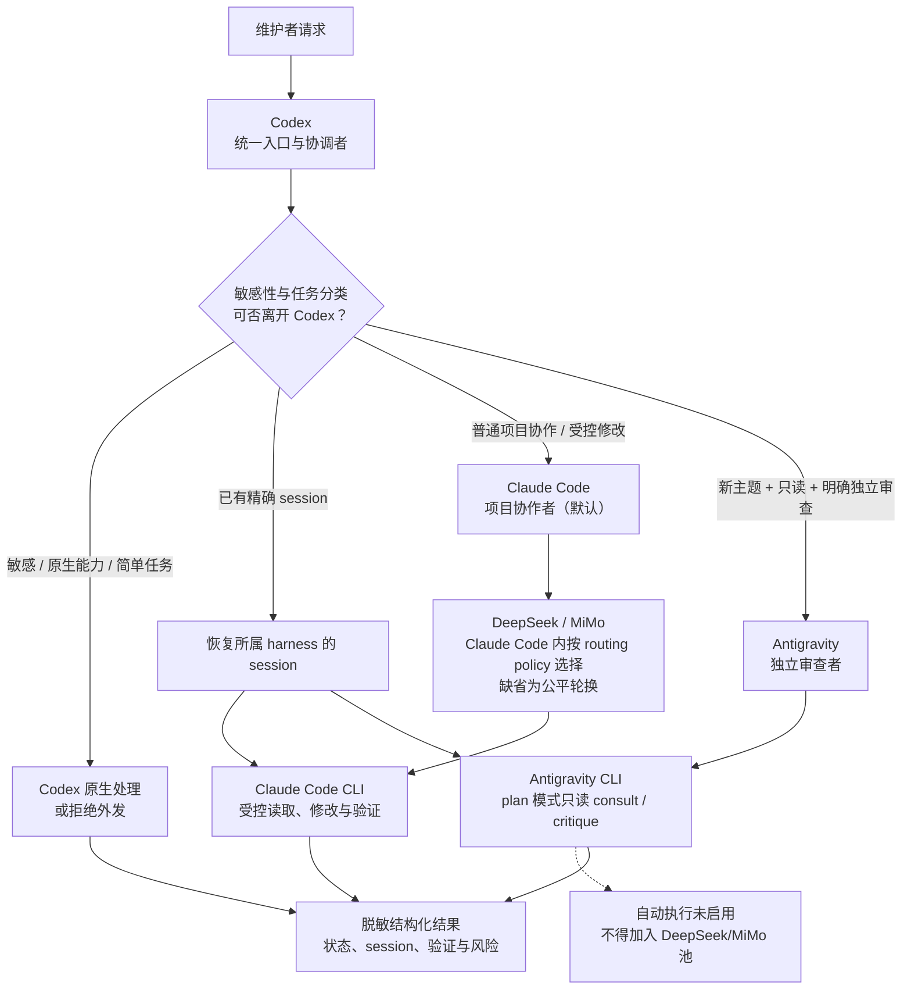
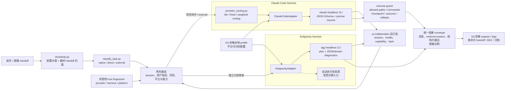

# 外部 Agent 协作技能架构图

本图说明当前已验收的产品分工和技术边界。适用于 macOS 与 Windows；两端各自使用 Git 忽略的本地 profile、trust 和运行态记录，绝不交换 CLI session 或凭据。

## 产品架构：谁处理什么任务

关键规则：Claude Code 是唯一的自动项目 execute harness。Antigravity 只能处理无历史、无敏感、只读且明确要求第二方案、反方意见或风险审查的任务；它在 macOS 与 Windows 的隔离写入验证均未完成唯一目标，因此不升级为执行器。

## 技术架构：请求如何成为可审计结果

### 不可跨越的边界

|边界|规则|
|---|---|
|Harness 与 provider|Antigravity 是独立 harness，不是 DeepSeek/MiMo 的第三个 provider。|
|Session|session 绑定 harness、profile、provider、工作目录、平台与 workspace identity；禁止跨 harness/跨平台恢复。|
|凭据|token 只保存在 Git 忽略的 local profile；不得写入 handoff、输出、日志或版本库。|
|执行|Claude Code execute 必须通过允许路径、命令白名单、checkpoint、outcome 和 rollback；AGY execute 当前不可用。|
|跨平台|macOS 与 Windows 分别验证 launcher、路径、profile、trust、session 和 capability；共享的是规范，不是本机运行态。|

相关设计依据：[技术方案文档](技术方案文档.md)、[实施计划文档](实施计划文档.md)、[DEC-20260731-headless-multiharness](决策记录/DEC-20260731-headless-multiharness.md) 和 [headless multi-harness 专题](专题/2026-07-31-headless-multiharness/README.md)。
